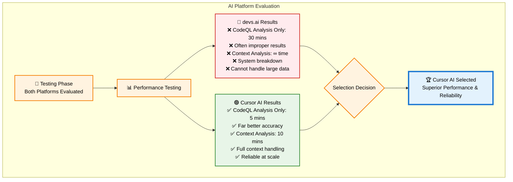
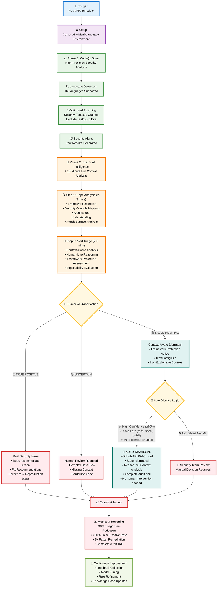
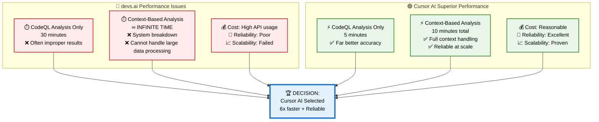
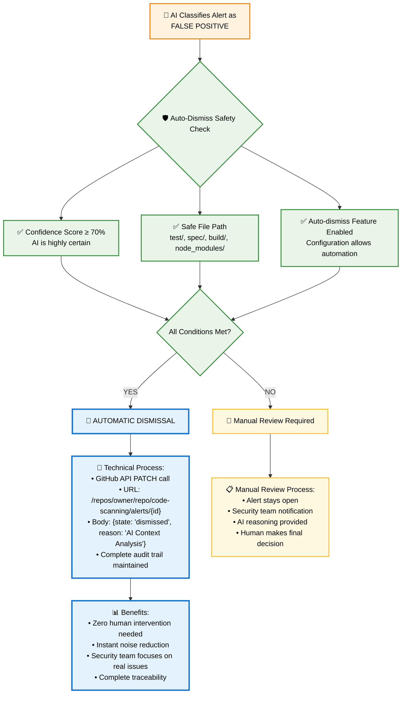
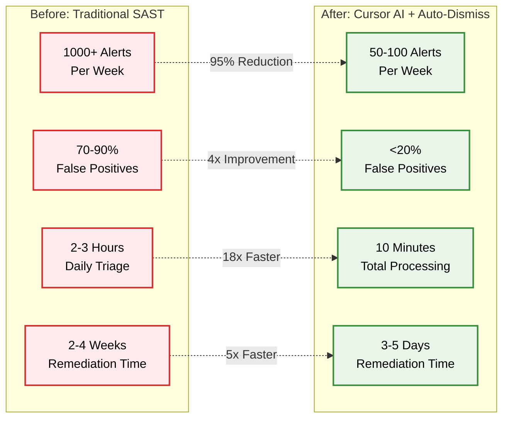
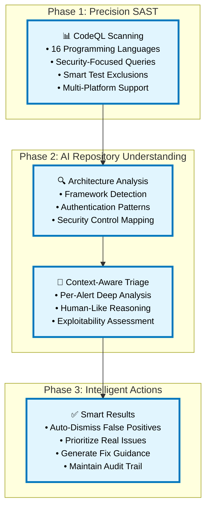

# DevSecOps + AI: Executive Presentation Diagram

## 🧪 **AI Platform Selection: Real Testing Results**

## 🎯 **Final Chosen Workflow with Cursor AI**

## ⚖️ **AI Platform Comparison: Why Cursor AI Won**

## 🔧 **AUTO-DISMISSAL: Detailed Explanation**

## 📈 **Business Impact: Cursor AI Results**

## 🎯 **Three-Phase Intelligence Pipeline**

