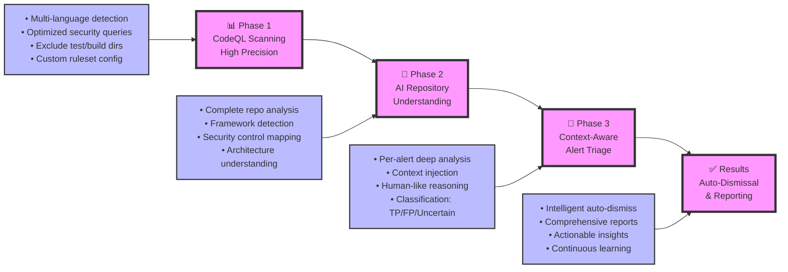
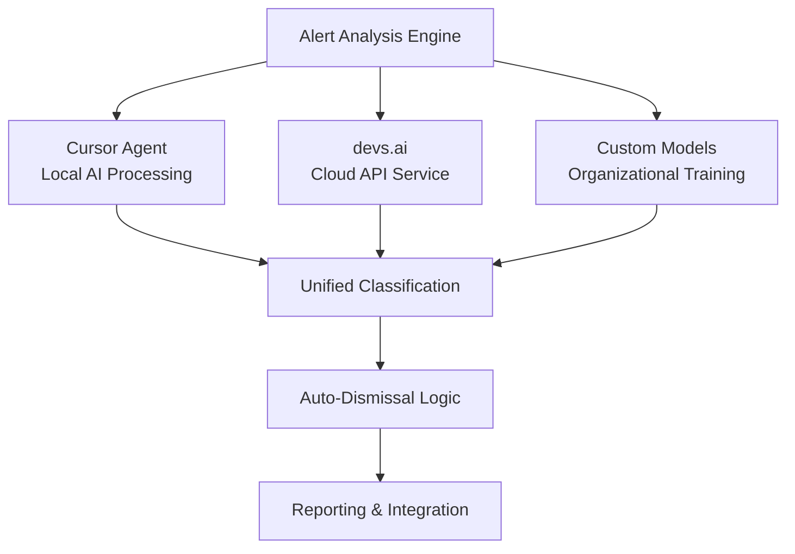

# DevSecOps + AI: Simplified Workflow Overview

## 🎯 **The Problem We're Solving**
Traditional SAST tools generate thousands of alerts with 70-90% false positives, overwhelming security teams and developers. Our solution: **AI-powered contextual triage that thinks like a human security expert**.

---

## 🔄 **Three-Phase Intelligent Security Pipeline**



---

## 🧠 **AI Intelligence: How It Thinks Like a Human**

### **Phase 2A: Repository Understanding** 
```
🔍 "Let me understand this entire application first..."

• What type of app is this? (Web API, CLI, Library)
• What frameworks are used? (Express, Django, Spring)  
• How does authentication work? (JWT, Sessions, OAuth)
• What security controls exist? (CSRF, CORS, Input validation)
• What's the attack surface? (Endpoints, file uploads, databases)
```

### **Phase 2B: Alert Analysis with Full Context**
```
🎯 "Now let me analyze each alert with complete understanding..."

FOR EACH ALERT:
• Extract vulnerable code + surrounding context
• Map data flow: Source → Processing → Sink
• Check framework protections (ORM, auto-escaping, etc.)
• Verify exploitability in this specific architecture
• Consider if code path is actually reachable

CLASSIFICATION LOGIC:
✅ TRUE POSITIVE: "User input flows to dangerous sink without proper sanitization"
❌ FALSE POSITIVE: "Framework handles this safely" OR "Test file" OR "Static data"
🟡 UNCERTAIN: "Complex flow needs human review"
```

---

## 📊 **Results & Impact**

### **Before: Traditional SAST**
- ❌ Too many alerts per scan
- ❌ 70-90% false positive rate  
- ❌ Hours of manual triage needed
- ❌ Developer + Security Engineer alert fatigue
- ❌ Real issues buried in noise

### **After: AI-Enhanced SAST**
- ✅ ~50-100 actionable alerts
- ✅ <20% false positive rate
- ✅ Minutes for complete triage
- ✅ High developer confidence + greater assistance for Security Engineer
- ✅ Real issues prioritized

---

## ⚙️ **Technical Architecture**

### **Multi-AI Backend Support**


### **Context-Aware Processing**
| Component | Purpose | Technology |
|-----------|---------|------------|
| **Language Detection** | Multi-language repo scanning | Git file analysis + regex |
| **Context Builder** | Code relationship mapping | ctags + ripgrep + AST parsing |
| **AI Reasoning Engine** | Human-like security analysis | LLMs with security-tuned prompts |
| **Classification Engine** | TP/FP determination | Multi-strategy JSON parsing |
| **Auto-Dismissal** | Safe false positive removal | GitHub API integration |

---

## 🎛️ **Configuration & Customization**

### **Adjustable Parameters**
```yaml
# Workflow Configuration
ALERT_STATE: "open"           # open/closed/all
MAX_ALERTS: 300               # Processing limit
AUTO_DISMISS: true            # Enable auto-dismissal
CURSOR_MODEL: "sonnet-4.5"    # AI model selection

# Safety Controls  
SAFE_PATH_HINTS: "test,spec,build,node_modules"
MIN_CONFIDENCE_FOR_DISMISS: 70
DISMISS_REASON: "AI Context Analysis - False Positive"
```

### **Custom Security Rules**
- Framework-specific protection patterns
- Organization-specific security policies  
- Custom vulnerability classifications
- Domain-specific context rules

---

## 📈 **Business Value**

### **Security Team Benefits**
- **90% reduction** in manual triage time
- **Focus on real threats** instead of alert fatigue
- **Continuous learning** from feedback loops
- **Scalable security** across growing codebases

### **Development Team Benefits**  
- **Actionable alerts only** - no more noise
- **Context-rich explanations** for each issue
- **Fix recommendations** with specific guidance
- **Reduced security friction** in development workflow

### **Organizational Benefits**
- **Faster vulnerability remediation** cycles
- **Lower security operational costs** 
- **Improved security posture** with precision targeting
- **Data-driven security decisions** with comprehensive metrics

---
---

*This workflow transforms security scanning from "alert spam" to "intelligent security advisory" - providing the precision and context that security teams need to focus on what actually matters.*
